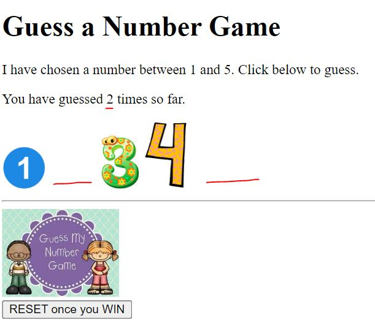

# Guess the Number Game

This project contains a JavaScript practice exam where the goal is to build a simple "Guess the Number" game.

## Project Structure

- `PracticeExam-GuessANumber - Student Files/`: starter files for the assignment
- `PracticeExam-GuessANumber-SOLUTION/`: completed reference solution
- `ScreenShot_Practice_Solution.JPG`: screenshot of the finished solution

## Assignment Overview

Create a "choose a number" game.

### Required Screen Elements

- Header
- Instructions
- Five buttons representing the numbers `1` through `5`
- A paragraph element to display the result of the guess

## Initial Game Behavior

- Generate a random number between `1` and `5`
- When a number button is clicked:
	- Check whether the selected number matches the random number
	- If it matches, display `You Win`
	- If it does not match, display `Keep Guessing`
	- Hide the selected button after it is clicked

## Additional Requirements

- Add a `New Game` button that:
	- shows all five number choices again
	- generates a new random number
- Use event listeners so the player cannot continue selecting numbers after a correct guess
- Re-enable the event listeners when the game is reset
- Use images instead of:
	- the five number buttons
	- the text messages for `You Win` and `Keep Guessing`
- Add a guess counter and display the total number of guesses on the page

## Solution Screenshot

